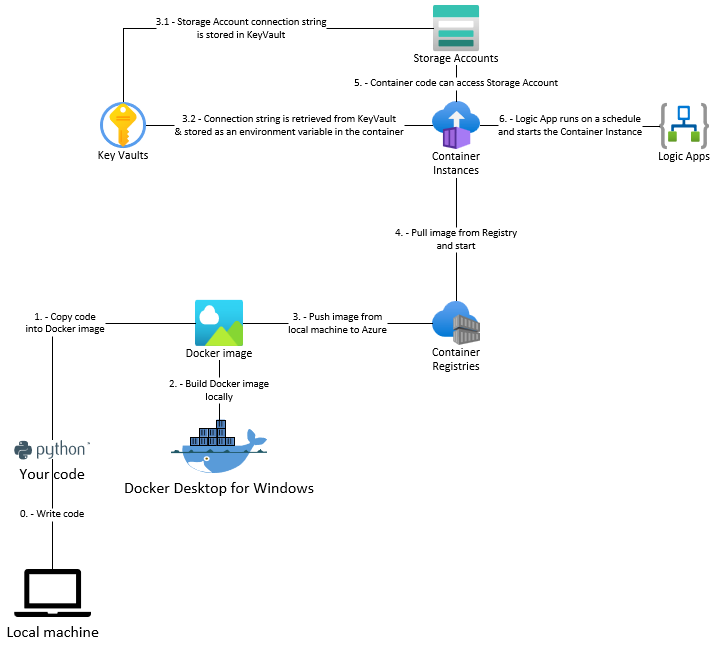

# data-factory-aci

This repo shows how to use [Azure Container Instance](https://docs.microsoft.com/en-us/azure/container-instances/container-instances-overview) to execute a Python script. It also shows how to build the container image that runs the Python in both Windows & Linux. In addition, it shows how to pull a connection string from KeyVault and make it available to the running container code. Finally, it shows how to set up a [Azure Logic App](https://docs.microsoft.com/en-us/azure/logic-apps/logic-apps-overview) to run this container on a schedule.



## Disclaimer

## Prerequisites

- [Docker Desktop for Windows](https://docs.docker.com/desktop/windows/install/)
- [Azure CLI](https://docs.microsoft.com/en-us/cli/azure/install-azure-cli)
- Azure subscription & resource group
- [Python 3.8 or greater](https://www.python.org/downloads/)

## Deployment

### Deploy initial infrastructure

1.  Customize the `/infra/init/dev.parameters.json` file as needed.

1.  Deploy the initial infrastructure (KeyVault, Log Analytics, Managed Identity, etc) to your Resource Group.

```shell
az deployment group create -g rg-dataFactoryAci-ussc-dev --template-file ./infra/init/main.bicep --parameters ./infra/init/env/dev.parameters.json --query "properties.outputs"
```

1.  Take note of the output of the above command. You will need the names of the resources created here for the container instance deployment step of the process.

```json
{
  "containerRegistryName": {
    "type": "String",
    "value": "la-dataFactoryAci-ussc-dev"
  },
  "keyVaultName": {
    "type": "String",
    "value": "kvdataFactoryAciusscdev"
  },
  "logAnalyticsWorkspaceName": {
    "type": "String",
    "value": "mi-dataFactoryAci-ussc-dev"
  },
  "managedIdentityName": {
    "type": "String",
    "value": "mi-dataFactoryAci-ussc-dev"
  }
}
```

### Build Linux container image locally & push to Azure Container Registry

1.  Execute the Python script locally to ensure it runs

```shell
python -m ./src/main
```

1.  Build a Docker image locally

```shell
docker build -t demo-linux -f ./src/Dockerfile-linux ./src
```

1.  Execute the Docker image locally to ensure it runs & outputs the same values as running Python manually.

```shell
docker run demo-linux
```

1.  Tag the Docker image with the name of your Azure Container Registry so you can push it to the registry.

```shell
docker tag demo-linux crdatafactoryaciusscdev.azurecr.io/demo-linux
```

1.  Login to Azure, set the Container Registry & push your local image to the registry.

```shell
az acr login --name crdatafactoryaciusscdev
docker push crdatafactoryaciusscdev.azurecr.io/demo-linux
```

### Build Windows container image locally & push to Azure Container Registry

1.  Execute the Python script locally to ensure it runs

```shell
python -m ./src/main
```

1.  Build a Docker image locally

```shell
docker build -t demo-windows -f ./src/Dockerfile-windows ./src
```

1.  Execute the Docker image locally to ensure it runs & outputs the same values as running Python manually.

```shell
docker run demo-windows
```

1.  Tag the Docker image with the name of your Azure Container Registry so you can push it to the registry.

```shell
docker tag demo-windows crdatafactoryaciusscdev.azurecr.io/demo-windows
```

1.  Login to Azure, set the Container Registry & push your local image to the registry.

```shell
az acr login --name crdatafactoryaciusscdev
docker push crdatafactoryaciusscdev.azurecr.io/demo-windows
```

### Deploy Container Instance & Logic App to Azure

1.  Customize the `/infra/container/dev.parameters.json` file as needed.

1.  Create 2 local shell variables to store the complex parameter objects that need to be passed in. The following example is for Windows.

```shell
$linux = '{ \"imageName\": \"demo-linux\", \"imageVersion\": \"latest\", \"osType\": \"Linux\"}'
$windows = '{ \"imageName\": \"demo-windows\", \"imageVersion\": \"latest\", \"osType\": \"Windows\"}'
```

1.  Deploy the Container Instance infrastructure to your Resource Group.

```shell
az deployment group create -g rg-dataFactoryAci-ussc-dev --template-file ./infra/container/main.bicep --parameters ./infra/container/env/dev.parameters.json --parameters containerRegistryName=crdatafactoryaciusscdev keyVaultName=kvdataFactoryAciusscdev logAnalyticsWorkspaceName=la-dataFactoryAci-ussc-dev managedIdentityName=mi-dataFactoryAci-ussc-dev numberOfContainersToCreate=1 storageAccountName=sadatafactoryaciusscdev storageAccountConnectionStringSecretName=sadataFactoryAciusscdev-connection-string linuxContainerSettings=$linux windowsContainerSettings=$windows
```

### Initialize the Logic App Connector

## Review the container instance running in Azure

## Review the Logic App

## Links

- [Azure Container Instance](https://docs.microsoft.com/en-us/azure/container-instances/container-instances-overview)
- [Docker commands](https://docs.docker.com/engine/reference/commandline/docker/)
- [Azure Logic Apps](https://docs.microsoft.com/en-us/azure/logic-apps/logic-apps-overview)
