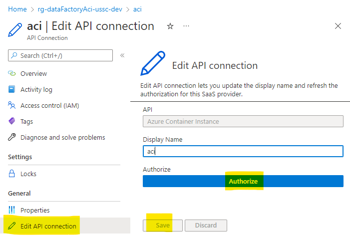
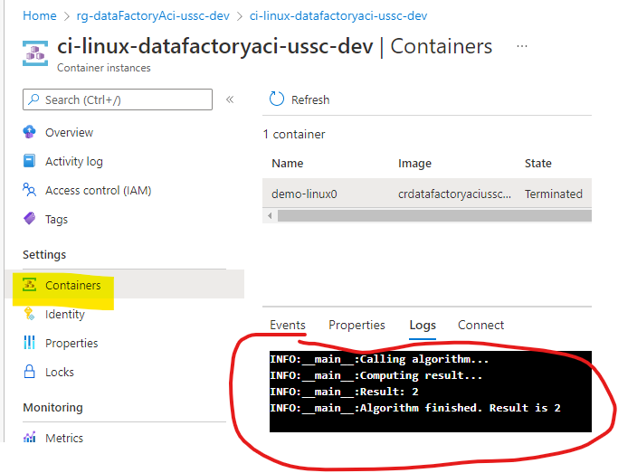
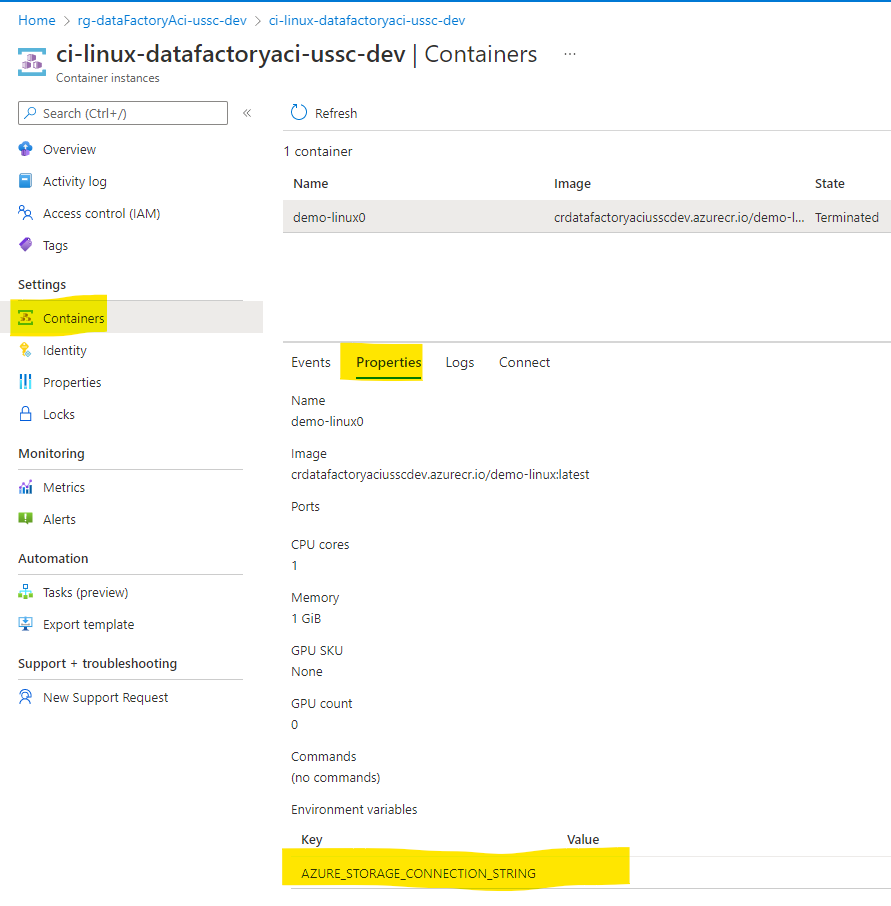
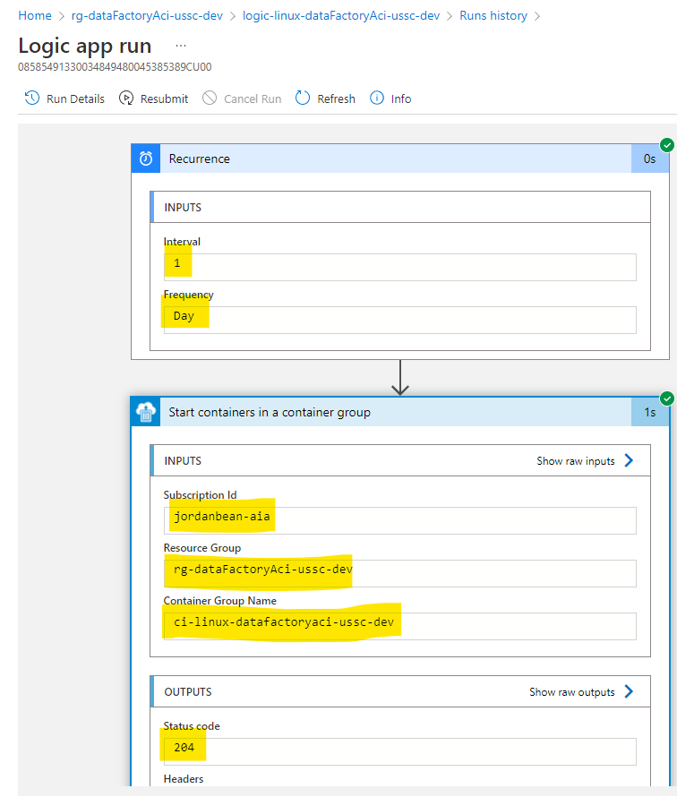

# data-factory-aci

This repo shows how to use [Azure Container Instance](https://docs.microsoft.com/en-us/azure/container-instances/container-instances-overview) to execute a Python script. It also shows how to build the container image that runs the Python in both Windows & Linux. In addition, it shows how to pull a connection string from KeyVault and make it available to the running container code. Finally, it shows how to set up a [Azure Logic App](https://docs.microsoft.com/en-us/azure/logic-apps/logic-apps-overview) to run this container on a schedule.


## Disclaimer

**THE SOFTWARE IS PROVIDED "AS IS", WITHOUT WARRANTY OF ANY KIND, EXPRESS OR IMPLIED, INCLUDING BUT NOT LIMITED TO THE WARRANTIES OF MERCHANTABILITY, FITNESS FOR A PARTICULAR PURPOSE AND NONINFRINGEMENT. IN NO EVENT SHALL THE AUTHORS OR COPYRIGHT HOLDERS BE LIABLE FOR ANY CLAIM, DAMAGES OR OTHER LIABILITY, WHETHER IN AN ACTION OF CONTRACT, TORT OR OTHERWISE, ARISING FROM, OUT OF OR IN CONNECTION WITH THE SOFTWARE OR THE USE OR OTHER DEALINGS IN THE SOFTWARE.**

## Prerequisites

- [Docker Desktop for Windows](https://docs.docker.com/desktop/windows/install/)
- [Azure CLI](https://docs.microsoft.com/en-us/cli/azure/install-azure-cli)
- Azure subscription & resource group
- [Python 3.8 or greater](https://www.python.org/downloads/)

## Deployment

### Deploy initial infrastructure

1.  Customize the `/infra/init/dev.parameters.json` file as needed.

1.  Deploy the initial infrastructure (KeyVault, Log Analytics, Managed Identity, etc) to your Resource Group.

```shell
az deployment group create -g rg-dataFactoryAci-ussc-dev --template-file ./infra/init/main.bicep --parameters ./infra/init/env/dev.parameters.json --query "properties.outputs"
```

1.  Take note of the output of the above command. You will need the names of the resources created here for the container instance deployment step of the process.

```json
{
  "containerRegistryName": {
    "type": "String",
    "value": "crdatafactoryaciusscdev"
  },
  "keyVaultName": {
    "type": "String",
    "value": "kvdataFactoryAciusscdev"
  },
  "logAnalyticsWorkspaceName": {
    "type": "String",
    "value": "mi-dataFactoryAci-ussc-dev"
  },
  "managedIdentityName": {
    "type": "String",
    "value": "mi-dataFactoryAci-ussc-dev"
  }
}
```

### Build Linux container image locally & push to Azure Container Registry

1.  Execute the Python script locally to ensure it runs

```shell
python -m ./src/main
```

1.  Make sure you have configured Docker Desktop for Windows to use **Linux** containers, not **Windows** containers. Right-click on the Docker Desktop icon in the system tray and select `Switch to Linux containers`.

1.  Build a Docker image locally

```shell
docker build -t demo-linux -f ./src/Dockerfile-linux ./src
```

1.  Execute the Docker image locally to ensure it runs & outputs the same values as running Python manually.

```shell
docker run demo-linux
```

1.  Tag the Docker image with the name of your Azure Container Registry so you can push it to the registry.

```shell
docker tag demo-linux crdatafactoryaciusscdev.azurecr.io/demo-linux
```

1.  Login to Azure, set the Container Registry & push your local image to the registry.

```shell
az acr login --name crdatafactoryaciusscdev
docker push crdatafactoryaciusscdev.azurecr.io/demo-linux
```

### Build Windows container image locally & push to Azure Container Registry

1.  Execute the Python script locally to ensure it runs.

```shell
python -m ./src/main
```

1.  Make sure you have configured Docker Desktop for Windows to use **Windows** containers, not **Linux** containers. Right-click on the Docker Desktop icon in the system tray and select `Switch to Windows containers`.

1.  Build a Docker image locally.

```shell
docker build -t demo-windows -f ./src/Dockerfile-windows ./src
```

1.  Execute the Docker image locally to ensure it runs & outputs the same values as running Python manually.

```shell
docker run demo-windows
```

1.  Tag the Docker image with the name of your Azure Container Registry so you can push it to the registry.

```shell
docker tag demo-windows crdatafactoryaciusscdev.azurecr.io/demo-windows
```

1.  Login to Azure, set the Container Registry & push your local image to the registry.

```shell
az acr login --name crdatafactoryaciusscdev
docker push crdatafactoryaciusscdev.azurecr.io/demo-windows
```

### Deploy Container Instance & Logic App to Azure

1.  Customize the `/infra/container/dev.parameters.json` file as needed.

1.  Create 2 local shell variables to store the complex parameter objects that need to be passed in. The following example is for Windows.

```shell
$linux = '{ \"imageName\": \"demo-linux\", \"imageVersion\": \"latest\", \"osType\": \"Linux\"}'
$windows = '{ \"imageName\": \"demo-windows\", \"imageVersion\": \"latest\", \"osType\": \"Windows\"}'
```

1.  Deploy the Container Instance infrastructure to your Resource Group.

```shell
az deployment group create -g rg-dataFactoryAci-ussc-dev --template-file ./infra/container/main.bicep --parameters ./infra/container/env/dev.parameters.json --parameters containerRegistryName=crdatafactoryaciusscdev keyVaultName=kvdataFactoryAciusscdev logAnalyticsWorkspaceName=la-dataFactoryAci-ussc-dev managedIdentityName=mi-dataFactoryAci-ussc-dev numberOfContainersToCreate=1 storageAccountName=sadatafactoryaciusscdev storageAccountConnectionStringSecretName=sadataFactoryAciusscdev-connection-string linuxContainerSettings=$linux windowsContainerSettings=$windows
```

### Initialize the Logic App Connector

The Azure Container Instance (ACI) connector must be initialized with credentials so it can start the Azure Container Instances as needed. You can authorize it to do this as your identity or a managed identity. In this example, we will authorize it with your ID.

1.  Navigate to the [Azure portal](https://portal.azure.com) and navigate to your subscription & resource group.

1.  Click on the `aci` API Connection resource.

1.  Click on the `Edit API connection` button.

1.  Click on the `Authorize` button, then `Save`.



## Review the container instance running in Azure

1.  Navigate to the [Azure portal](https://portal.azure.com) and navigate to your subscription & resource group.

1.  Click on one of the `Azure Container Instance` instances.

1.  On the `Containers` tab, you can see that the container is now terminated (since it ran to completion).

1.  Click on the `Logs` tab to see the logs the container generated as it ran. These should match the values that were output by the Python script when running locally.



1.  Click on the `Properties` tab to see the container instance properties, including the environment variable that stores the storage account connection string that was retrieved from the Key Vault.



## How to get the storage account connection string secret from the Key Vault into the Azure Container Instance

We need the Python code running inside the Container Instance to be able to access the storage account connection string. We can get the storage account connection string secret from the KeyVault and store it in an environment variable. Normally, this would be done by using a managed identity that has access to the KeyVault, but Windows container instances can't use managed identity at this time (and it is in preview for Linux containers).

Therefore, we can pull this secret at deployment time as part of the Azure Resource Manager deployment. ARM will pull the secret and store the value as an environment variable in the container instance.

## Review the Logic App

1.  Navigate to the [Azure portal](https://portal.azure.com) and navigate to your subscription & resource group.

1.  Click on the `Logic App` resource.

1.  The first execution is likely to have failed because the `aci` connection was not initialized on initial deployment. Re-run the Logic App to ensure it runs. Click on the `Run Trigger->Run` button on the `Overview` blade.

1.  Click on the most recent run on the `Runs history` tab on the `Overview` blade.



This Logic App will run once per day and start the Azure Container Instance.

## Links

- [Azure Container Instance](https://docs.microsoft.com/en-us/azure/container-instances/container-instances-overview)
- [Docker commands](https://docs.docker.com/engine/reference/commandline/docker/)
- [Azure Logic Apps](https://docs.microsoft.com/en-us/azure/logic-apps/logic-apps-overview)
